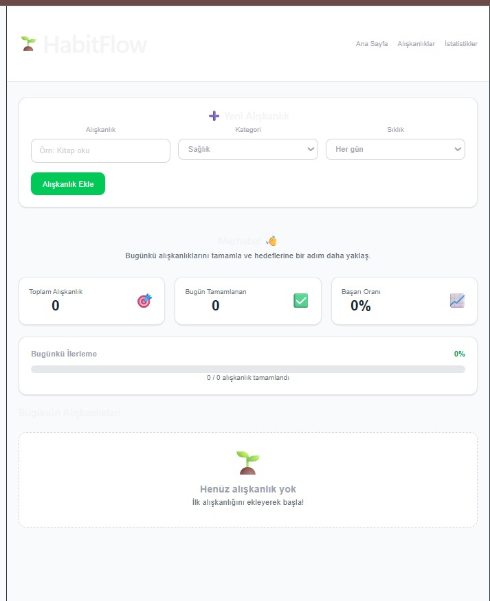
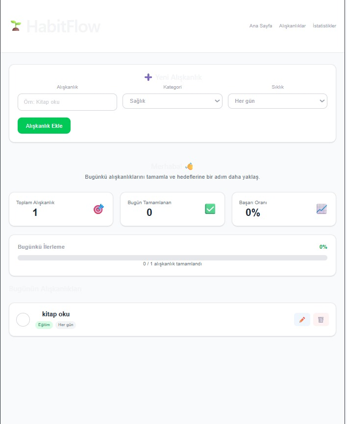
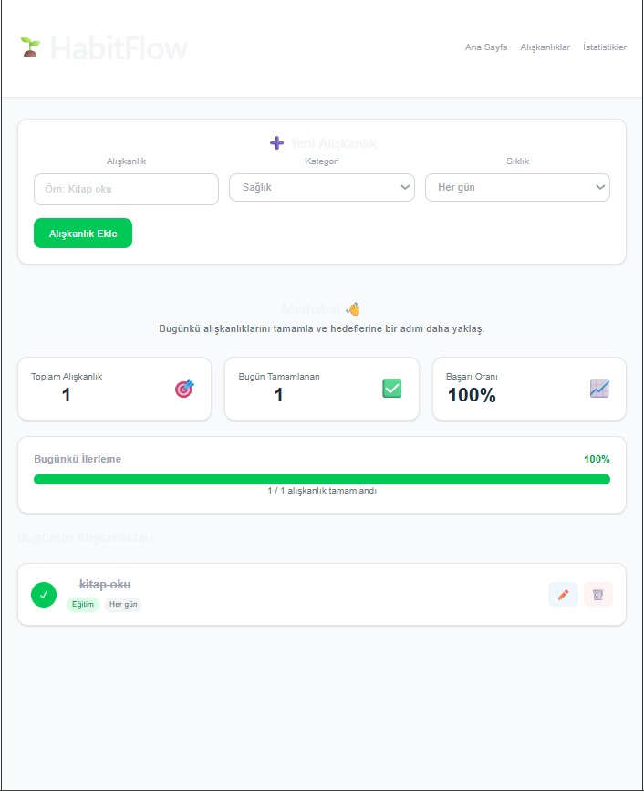

# HabitFlow 🌱

HabitFlow, kullanıcıların günlük alışkanlıklarını ekleyip takip edebildiği bir web uygulamasıdır. Kullanıcılar yeni bir alışkanlık ekleyebilir, mevcut alışkanlıkları güncelleyebilir, silebilir ve her gün tamamlayıp tamamlamadıklarını işaretleyebilir.

## Kullanılan Teknolojiler

- React (Vite ile kurulmuştur)
- Tailwind CSS
- LocalStorage (veriler tarayıcıda saklanır)

## Özellikler

- ✅ Alışkanlık ekleme
- ✅ Alışkanlıkları listeleme
- ✅ Alışkanlık güncelleme
- ✅ Alışkanlık silme
- ✅ Günlük tamamlama takibi ve istatistikler

## Nasıl Çalıştırılır

```bash
npm install
npm run dev
```

## Ekran Görüntüsü 

## Ekran Görüntüsü





## Canlı Demo 

(https://habitflow3407.netlify.app)

## GitHub Linki
(https://github.com/firdevsnml/habit-flow)